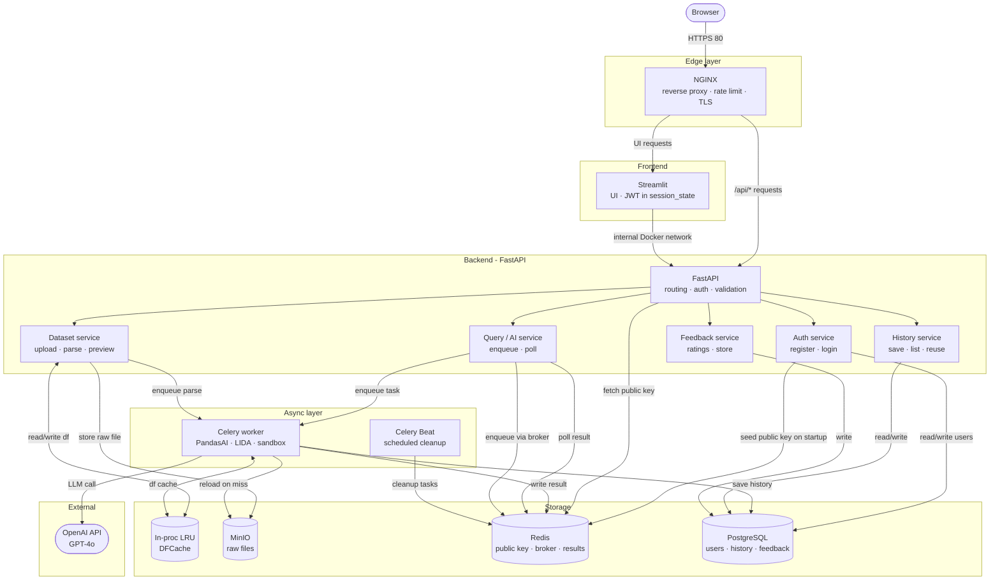

# AI Data Assistant

> An AI-powered web application that lets users upload CSV/Excel files, explore data, ask natural language questions, generate charts, and manage prompt history.

---

## Table of Contents

1. [Overview](#overview)
2. [Functional Requirements](#functional-requirements)
3. [Non-Functional Requirements](#non-functional-requirements)
4. [Technology Stack](#technology-stack)
5. [System Architecture](#system-architecture)
6. [Quick Start](#quick-start)
7. [Further Improvements](#further-improvements)

---

## Overview

This application allows users to:

- Register and sign in with name, email, and password
- Upload one or more CSV / Excel (`.csv`, `.xlsx`, `.xls`) files
- Preview the top N rows of any uploaded sheet
- Ask natural language questions about their data and receive AI-generated answers and charts
- Browse and reuse a history of past prompts
- Rate answers with thumbs up / thumbs down feedback

The system is designed around five pillars: **scalability**, **reliability**, **availability**, **performance efficiency**, and **security**.

---

## Functional Requirements

### 1. Authentication
- User registers with first name, last name, email, and password
- Password must satisfy all of the following rules:
  - Minimum 8 characters
  - At least one uppercase letter (A–Z)
  - At least one lowercase letter (a–z)
  - At least one number (0–9)
  - At least one special character (`!@#$%^&*`)
- Password hashed with bcrypt
- Login issues a JWT signed with RS256 (asymmetric key pair):
  - **Private key:** stored in `.env`, loaded into the Auth container only. Used to sign the token at login
  - **Public key:** cached Redis to verify tokens 
  - **Token:** held in Streamlit `st.session_state`
- Every API request carries the JWT in `Authorization: Bearer`. FastAPI fetches the public key from Redis and verifies the signature and expiry locally
- Logout clears `st.session_state` - the token expires naturally within its TTL

### 2. File Upload
- User uploads one or more `.csv`, `.xlsx`, or `.xls` files
- Minimum file size: 250 rows
- System validates file type, size (max 10 MB), and content
- System parses file, extracts schema and metadata, assigns a `dataset_id`
- Raw file stored in MinIO object storage

### 3. Data Preview
- User selects a dataset and a sheet (for multi-sheet Excel files)
- User defines N (top N rows to display)
- System returns a paginated table view

### 4. AI Query
- User types a free-text question about the selected dataset
- System generates a natural language answer and optionally a chart
- Model is capable of generating graphs

### 5. Prompt History
- Every prompt and its result is persisted per session
- User can browse past prompts filtered by dataset
- User can one-click reuse a past prompt

### 6. Feedback (Bonus)
- User can rate each answer: 👍 useful (+1) or 👎 not useful (−1)

---

## Non-Functional Requirements

| Pillar | Requirement | Solution |
|---|---|---|
| **Scalability** | Handle many users, datasets, queries | Stateless FastAPI replicas behind NGINX load balancer; Celery workers scale independently via shared Redis task queue |
| **Reliability** | No crash on bad prompts, large files, or code errors | RestrictedPython sandbox; Celery re-queues on worker crash; exponential backoff retry on OpenAI calls; multi-layer file validation |
| **Availability** | Service always responds | Async FastAPI offloads slow LLM calls to Celery, keeping HTTP responsive |
| **Performance** | Low latency for common operations | In-process LRU DFCache for DataFrames; async Celery queue decouples slow operations; Redis caches history results for reruns without repeat LLM calls |
| **Security** | Protect API key, prevent code injection, isolate sessions | RestrictedPython sandbox; API key management; NGINX IP-based rate limiting; bcrypt password hashing |

---

## Technology Stack

- **Frontend:** Streamlit
- **Backend API:** FastAPI + Uvicorn
- **AI Engine:** PandasAI + Microsoft LIDA
- **Code Sandbox:** RestrictedPython
- **Task Queue:** Celery
- **Message Broker:** Redis 
- **DataFrame Cache:** In-process LRU dict
- **Query Result Cache:** Redis (history rerun only, not free-text queries)
- **File Storage:** MinIO
- **Database:** PostgreSQL
- **Reverse Proxy:** NGINX 
- **Containerization:** Docker Compose

---

## System Architecture



---

## Quick Start

```bash
git clone https://github.com/haiyen11231/ai-data-assistant.git
cd ai-data-assistant
touch .env
docker compose up --build
```

---

## Further Improvements

- **Streaming:** stream LLM tokens via SSE for faster perceived response
- **Vector search:** embed questions + schema to find semantically similar past prompts
- **Kubernetes:** swap Docker Compose for K8s when horizontal scaling is needed
- **Kafka:** graduate from Celery+Redis if query volume exceeds ~10k/sec
