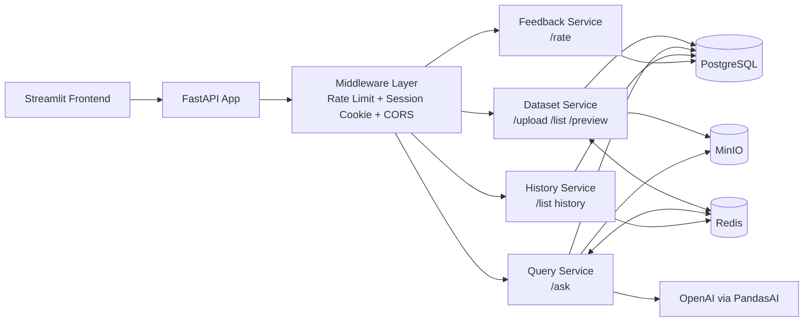

# AI Data Assistant

> An AI-powered web application that lets users upload CSV/Excel files, explore data, ask natural language questions, generate charts, and manage prompt history.

## Table of Contents

1. [Overview](#overview)
2. [System Architecture](#system-architecture)
3. [Functional Requirements](#functional-requirements)
4. [Non-Functional Requirements](#non-functional-requirements)
5. [Technology Stack](#technology-stack)
6. [Quick Start](#quick-start)
7. [Local Setup](#local-setup-without-docker)
8. [Further Improvements](#further-improvements)

## Overview

This application allows users to:

- Upload one or more CSV / Excel (`.csv`, `.xlsx`, `.xls`) files
- Preview the top N rows of any uploaded sheet
- Ask natural language questions about their data and receive AI-generated answers and charts
- Browse and reuse a history of past prompts
- Rate answers with thumbs up / thumbs down feedback

The system is designed around five pillars: **scalability**, **reliability**, **availability**, **performance efficiency**, and **security**.

## System Architecture



## Functional Requirements

### 1. File Upload
- User uploads one or more `.csv`, `.xlsx`, or `.xls` files
- Minimum file size: 250 rows
- System validates file type, size (max 10 MB), and content
- System parses file, extracts schema and metadata, assigns a `dataset_id`
- Raw file stored in MinIO object storage

### 2. Data Preview
- User selects a dataset and a sheet (for multi-sheet Excel files)
- User defines N (top N rows to display)
- System returns a paginated table view

### 3. AI Query
- User types a free-text question about the selected dataset
- System generates a natural language answer and optionally a chart
- Model is capable of generating graphs

### 4. Prompt History
- Every prompt and its result is persisted per session
- User can browse past prompts filtered by dataset
- User can one-click reuse a past prompt

### 5. Feedback (Bonus)
- User can rate each answer: 👍 useful (+1) or 👎 not useful (−1)

## Non-Functional Requirements

| Pillar | Requirement | Solution |
|---|---|---|
| **Scalability** | Handle many users, datasets, queries | Stateless FastAPI replicas behind NGINX load balancer; Celery workers scale independently via shared Redis task queue |
| **Reliability** | No crash on bad prompts, large files, or code errors | RestrictedPython sandbox; Celery re-queues on worker crash; exponential backoff retry on OpenAI calls; multi-layer file validation |
| **Availability** | Service always responds | Async FastAPI offloads slow LLM calls to Celery, keeping HTTP responsive |
| **Performance** | Low latency for common operations | In-process LRU DFCache for DataFrames; async Celery queue decouples slow operations; Redis caches history results for reruns without repeat LLM calls |
| **Security** | Protect API key, prevent code injection, isolate sessions | RestrictedPython sandbox; API key management; NGINX IP-based rate limiting |

## Technology Stack

- **Frontend:** Streamlit
- **Backend API:** FastAPI + Uvicorn
- **AI Engine:** PandasAI 
- **Code Sandbox:** RestrictedPython
- **Task Queue:** Celery (Have not implemented yet)
- **Message Broker:** Redis 
- **DataFrame Cache:** In-process LRU dict
- **Query Result Cache:** Redis (history rerun only, not free-text queries)
- **File Storage:** MinIO
- **Database:** PostgreSQL
- **Reverse Proxy:** NGINX (Have not implemented yet)
- **Containerization:** Docker Compose

## Quick Start

### Prerequisites
- Docker & Docker Compose
- Python 3.11

### 1. Clone and configure
```bash
git clone https://github.com/haiyen11231/ai-data-assistant.git
cd ai-data-assistant
touch .env
```

Edit `.env` and add your OpenAI API key:
```bash
# OpenAI 
OPENAI_API_KEY=sk-proj-xxx

# Postgres
POSTGRES_USER=aiuser
POSTGRES_PASSWORD=password
POSTGRES_DB=aiassistant

# Redis
REDIS_PASSWORD=changeme_redis_password

# MinIO
AWS_ACCESS_KEY_ID=minioadmin
AWS_SECRET_ACCESS_KEY=minio_password
AWS_DEFAULT_REGION=us-east-1
AI_BUCKET=ai-data-assistant
# S3_ENDPOINT_URL=http://localhost:9000   # local dev without Docker

# App
ALLOWED_ORIGINS=http://localhost:8501,http://frontend:8501
BACKEND_URL=http://localhost:8000
...
```

### 2. Start all services
```bash
docker-compose up --build
```

### 3. Open the app
- Frontend: http://localhost:8501
- Backend API docs: http://localhost:8000/api/docs

## Local Setup (without Docker)

```bash
python3.11 -m venv .venv
source .venv/bin/activate
```

### Backend
```bash
cd backend
pip install -r requirements.txt
...
```

### Frontend
```bash
cd frontend
pip install -r requirements.txt
streamlit run app.py
```

## To Do List

- [x] System should be able to allow users to upload 1 or more xls/csv files
- [x] System should be able to display top N rows of the sheets uploaded
  - [x] System should be able to allow users to define N
  - [x] System should be able to allow users to select which sheet/file to preview
- [x] System should have some suggested prompts according to selected sheets
- [x] System should be able to allow users to ask questions about uploaded data
    - [x] System should be able to return responses in different formats (text/table/chart)
    - [ ] System should be able to handle mixed response types (text + table + chart)
    - [ ] System should be able to handle edge cases
        - [x] System should be able to handle simple question (simple sentence)
        - [x] System should be able to handle complex question (compound sentence with multiple ideas)
        - [x] System should be able to handle no result / empty response
        - [ ] System should be able to handle invalid queries (Add Guardrail to filter unrelated question)
- [x] System should be able to support querying one sheet at a time
- [ ] System should be able to support querying multiple sheets/files (future improvement)
    - [ ] System should be able to define relationships or joins between datasets
    - [ ] System should be able to allow users to select multiple datasets

- [x] System should be able to store chat history per file/sheet per session
- [x] System should be able to allow users to reuse previous prompts (Caching)
- [x] System should be able to display chat history in the UI (in terms of question in stead of file or chat)
- [x] System should be able to allow users to provide feedback on responses
- [ ] System should be able to delete data record after user delete file

## Further Improvements

- **Async job queue with Celery + Redis:**
    - Move expensive AI query execution to Celery workers and return `job_id` immediately from API
    - Add job status endpoints and poll from frontend
    - Configure retries for transient OpenAI/network errors

- **Response with mixed outputs (text + table + chart)**

- **Add `dataset_ids` in `session cache` so that listing sheets can use `dataset cache` instead of hitting Postgres**

- **Input validation and guardrails:**
    - Strengthen query validation for malicious/invalid prompts
    - Add clearer user-facing error messages and remediation hints

- **NGINX reverse proxy:** Place FastAPI behind NGINX for routing, load balancing, and protection
